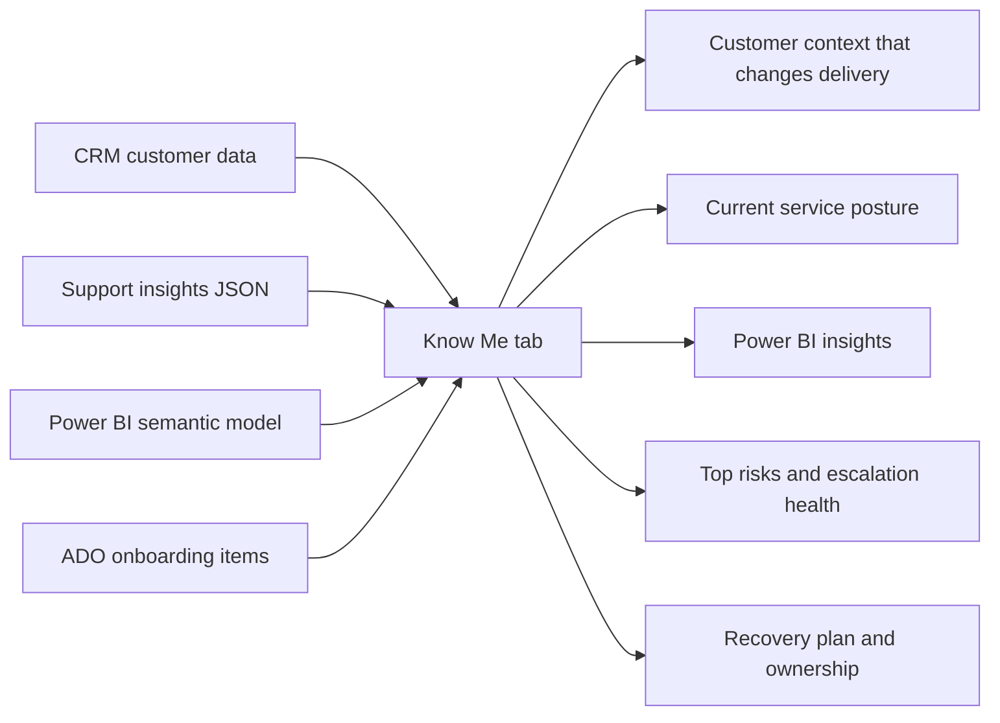
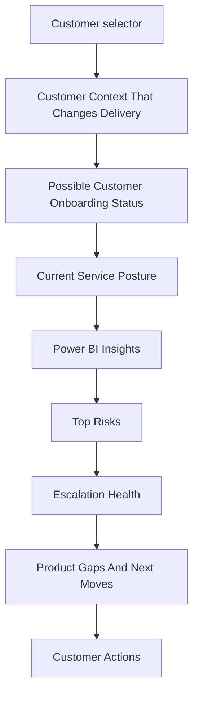
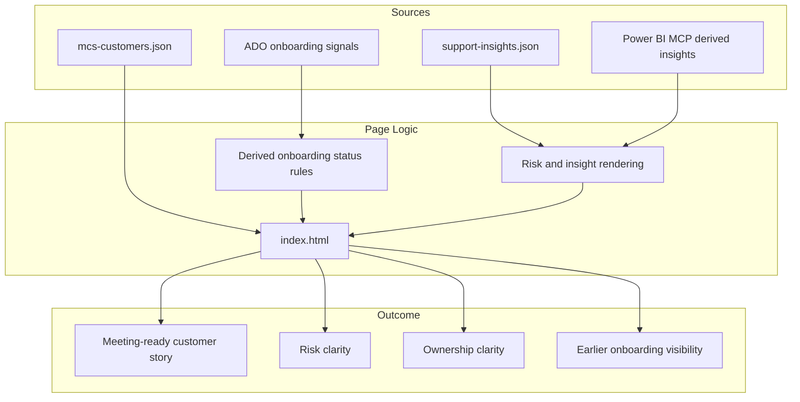

# Know Me Tab Update One-Pager

## Overview

The Know Me tab has been reshaped from a customer profile view into a service decision page.

The intent of the update is simple: when a user opens a customer, they should be able to understand current service risk, why it matters, and what Microsoft needs to do next without jumping across CRM, Power BI, ADO, and support reports.

This update focused on three outcomes:

- Reduce noise and remove profile-style content that does not change delivery behavior
- Bring current service and backlog signals into the page through Power BI insights
- Add onboarding readiness context so teams can see pre-onboarding risk before it becomes a support problem

## What Changed

### 1. Added Power BI Insights to Know Me

The page now includes a dedicated Power BI Insights section sourced from the MCSfMSC semantic model.

It surfaces:

- Filtered active-case pattern for the selected customer
- Backlog age mix
- Product concentration
- Status bottlenecks
- Trend highlights

This turns the page from a static summary into a view that reflects actual case pressure and backlog shape.

### 2. Added Customer Onboarding Status and ADO Signals

The page now includes a derived onboarding status plus a list of Shalini-related ADO onboarding signals.

The onboarding status is derived from existing customer attributes:

- Participant stage
- Participant status
- Onboard date

The ADO signals make open program-level pre-onboarding work visible in the page instead of leaving that context buried in Azure DevOps.

This gives the team early context on whether a customer is newly onboarded, still flagged as new, or already in a stable run-state.

### 3. Simplified and De-duplicated the Layout

The Know Me tab was also cleaned up to remove repeated or low-value content.

Removed:

- View Intent card next to the customer selector
- Scope Boundaries
- Special Operating Model
- Partner / Dependency
- Core Principle footer block

Renamed:

- Power BI Semantic Model Insights -> Power BI Insights

Merged:

- Customer Improvement Plan + Current Product Owner Motion -> Recovery Plan And Ownership
- Program stage concepts are now represented mainly through the onboarding status block rather than repeated in separate cards

## Why This Matters

Before this work, the Know Me tab still required users to interpret multiple disconnected signals on their own.

After this work, the page does more synthesis directly in the UI.

That improves:

- Executive readability
- Meeting preparation speed
- Clarity of ownership and next move
- Separation of support problems versus product-gap problems
- Visibility into onboarding risk and readiness

## Before vs. After

| Area | Before | After |
| --- | --- | --- |
| Page role | Customer context page | Service decision page |
| Power BI data | Separate analysis outside the page | Embedded as Power BI Insights |
| Onboarding context | Spread across CRM and ADO | Visible in Know Me as status plus ADO signals |
| Next-step guidance | Split across multiple cards | Consolidated into clearer risk and recovery sections |
| Readability | More profile-oriented | More action-oriented and review-ready |

## Updated Information Flow

## Screen Structure

## Architecture Snapshot

## Key Implementation Notes

- EY semantic-model insights were added into the support insight layer and rendered directly in Know Me
- A front-end binding bug in the Know Me update flow was fixed so support insights render correctly for selected customers
- ADO MCP was added and validated, but the page currently uses embedded ADO onboarding signals rather than a live browser-side call
- The onboarding status is currently rule-based and derived from CRM-style customer fields already present in the local data

## Executive Takeaway

The Know Me tab is no longer just a place to look up customer information.

It is now closer to a single-page service brief that combines customer context, support pressure, backlog shape, onboarding readiness, and next-action framing in one place.

That is the right direction for leadership reviews, support escalations, and customer-facing preparation.