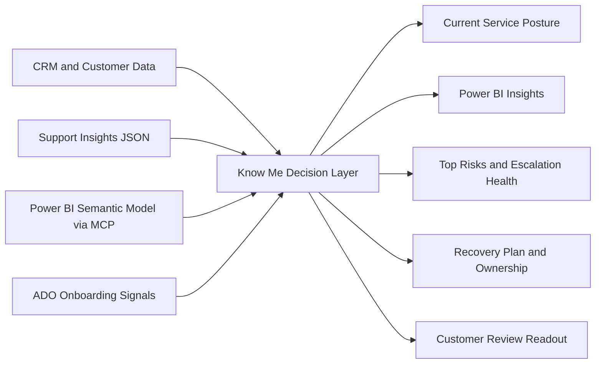
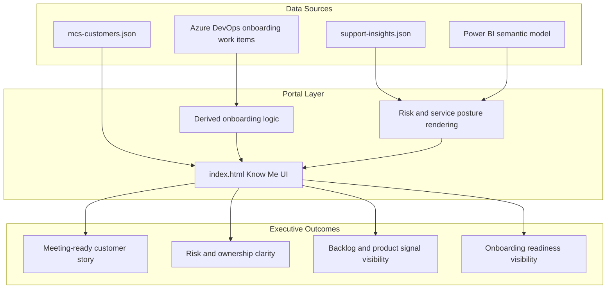
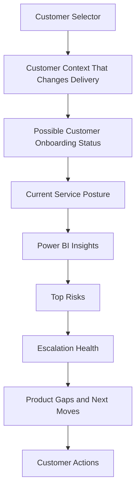

# MCS Customer View One-Pager

## Purpose

The MCS customer view should be a service decision page, not a customer profile page.

Its purpose is to help Mission Critical Services teams answer four questions quickly:

1. What is the most important service risk for this customer right now?
2. Why is this becoming a Mission Critical Services issue?
3. Who needs to act next?
4. What should we say or do in the next customer review?

This means the page should optimize for service action, not information density.

## Problem

Current customer pages tend to collect a lot of information but do not reliably help with service execution.

Common issues include:

- Too much static customer context and not enough operational signal
- Support data shown as raw volume rather than service risk
- CRM data shown as records rather than actionable ownership and roadmap context
- No clear separation between customer context, support posture, and next actions
- No meeting-ready summary for pre-sales, delivery, or health review conversations

The result is that teams still need to pull information from multiple tools before they can prepare for an MCS discussion.

## Design Principle

Customer view should be customer-centric, but service-led.

This means:

- The page starts with current service posture, not static profile details
- Only customer context that changes delivery or escalation behavior should be surfaced prominently
- CRM and NOMI should provide context and ownership, not dominate the page
- Support and telemetry should explain operational risk, not just workload volume
- The page should end in next actions, not in raw data

## What The Page Must Do

The page should help a user prepare for:

- A customer health review
- A support escalation discussion
- A pre-sales or renewal conversation where service quality matters
- A cross-functional sync with PM, CSAM, CSS, PHE, or support owners

If the page does not improve one of those workflows, the content likely does not belong in the main customer view.

## Proposed Information Architecture

### 1. Current Service Posture

Goal: show whether the customer is stable, at risk, or actively under pressure.

Suggested content:

- One-line service posture summary
- RAG status or equivalent service signal
- Top active Mission Critical Services concerns
- Backlog pressure and severity exposure
- Whether issues are escalating into ICM, CRI, or MCSfMSC patterns

This section answers: what is happening now?

### 2. Top Risks

Goal: show the few issues that deserve leadership or service-team attention.

Suggested structure per risk:

- Risk title
- Why it matters to the customer
- Current state
- Owner
- Next action
- Due date or review date

This section answers: where should we focus?

### 3. Escalation Health

Goal: show whether the support motion itself is healthy.

Suggested signals:

- Aging open cases
- Sev A/B concentration
- Reopen patterns
- Linked ICM or CRI volume
- Stale updates
- Multiple handoffs or unclear ownership
- Repeated customer follow-up for status

This section answers: is support execution creating or amplifying customer risk?

### 4. Product Gaps Driving Service Pain

Goal: connect support pain with CRM feature evidence and roadmap context.

Suggested content:

- Which support issues are really product gaps
- Existing feature requests or CRM evidence
- Feature owner or PM owner
- Preview, roadmap, or no-plan status
- Customer impact summary

This section answers: which issues cannot be solved through support alone?

### 5. Customer Context That Changes Delivery

Goal: keep only the context that materially affects service motion.

Suggested content:

- Tenant and scope boundaries
- In-scope workloads
- Key contacts relevant to current issues
- Operating model constraints
- Outsourcer or partner dependencies
- Known escalation sensitivities
- Strategic customer asks that affect service decisions

This section answers: what do we need to know before we act?

### 6. Next Review Brief

Goal: make the page meeting-ready.

Suggested content:

- What changed since the last review
- What needs customer attention
- What needs Microsoft attention
- Decisions needed this week
- Recommended talking points for the next sync

This section answers: what do we say next?

## What Should Not Be The Center Of The Page

The page should avoid becoming another generic customer dashboard.

Content that should be deprioritized:

- Long-form company description
- Generic product usage breakdowns with no service implication
- Large contact directories
- CRM fields with no operational value
- Historical data that does not affect current action

These items can still exist, but not as the main story.

## Relationship To CRM, NOMI, And Technical Assessment

The customer view should not merge everything into one flat experience.

Recommended separation:

- CRM / NOMI: customer context, ownership, relationships, program data
- Technical assessment / telemetry: health, adoption, configuration, operational indicators
- MCS customer view: decision layer that combines the minimum signals needed for service action

This aligns with the principle that Know Me and telemetry are complementary but distinct.

## Success Criteria

The page is successful if a user can open it and within a few minutes answer:

1. Is this customer currently healthy or at risk?
2. What are the top three things that matter right now?
3. Who owns each one?
4. What support or product friction is driving the problem?
5. What should happen before the next customer touchpoint?

## Working Definition

MCS customer view is the single customer-specific page inside the unified portal that turns customer context, support posture, and ownership signals into clear service actions.

It should help teams prepare, escalate, and communicate, not just browse information.

---

## Appendix: March 2026 Portal Update One-Pager

### Executive Summary

The latest portal update moved the Know Me experience closer to a true service decision page.

The main change is not cosmetic. The page now combines three signal types into one meeting-ready view:

- Customer context that actually changes delivery motion
- Current support and escalation pressure
- Power BI and ADO signals that explain where risk is building and what is still in flight

This gives leaders a faster way to answer three management questions:

1. What is the service risk right now?
2. Why is it happening?
3. Who needs to act next?

### What Changed

#### 1. Power BI insights were added directly into Know Me

The page now includes a dedicated Power BI Insights section sourced from the MCSfMSC semantic model through Power BI MCP.

It highlights:

- Filtered active-case pattern for the selected customer
- Backlog age mix
- Product concentration
- Status bottlenecks
- Recent trend highlights

This means leaders do not have to jump from the portal into Power BI just to understand whether the customer backlog is aging, concentrated, or changing shape.

#### 2. ADO onboarding signals were added to expose program readiness

The page now includes a customer onboarding status block and Shalini ADO onboarding signals.

This makes two things visible in one place:

- The likely customer onboarding state derived from participant stage, participant status, and onboard date
- Open pre-onboarding program items in ADO that indicate readiness work is still active

This is useful because onboarding risk often shows up before it becomes a support risk.

#### 3. The page was simplified to remove duplicate and low-value content

Several cards were removed or merged so the page reads more like a review brief and less like a data inventory.

Removed:

- View Intent card
- Scope Boundaries card
- Special Operating Model card
- Partner / Dependency card
- Core Principle footer block

Renamed:

- Power BI Semantic Model Insights -> Power BI Insights

Merged:

- Customer Improvement Plan + Current Product Owner Motion -> Recovery Plan And Ownership
- Program stage concepts are now primarily represented through the onboarding status block instead of being repeated in multiple places

### Why This Matters

Before this update, users still had to assemble the story themselves across CRM, support views, and Power BI.

After this update, the page does more of that synthesis for them.

The result is:

- Faster preparation for customer reviews
- Better escalation framing
- Clearer separation between support execution issues and product-gap issues
- Earlier visibility into onboarding risk and ownership ambiguity

### Before vs. After

| Area | Before | After |
| --- | --- | --- |
| Customer context | Included several profile-style fields | Reduced to only delivery-relevant context |
| Power BI usage | Separate analysis activity | Embedded into Know Me as Power BI Insights |
| Onboarding visibility | Hidden in CRM / ADO / tribal knowledge | Visible as derived status plus ADO signals |
| Next action clarity | Split across multiple sections | More explicit through risks, recovery plan, and ownership |
| Executive readability | Required interpretation across tools | Closer to one-screen service narrative |

### Updated Experience Flow

### Architecture View

### Screen-Level Schematic

### Leadership Takeaway

This update improves the portal in a way executives can immediately understand:

- It reduces noise
- It surfaces service risk faster
- It connects support, product, and onboarding signals in one page
- It makes the customer conversation easier to lead

In short, the portal is moving from a reference page to an operational decision page.

### Suggested Insert Title For The Word Document

If you want to append this to the SharePoint document, a clean heading would be:

**Recent Portal Enhancements: Power BI, Onboarding Signals, and Executive Readability**